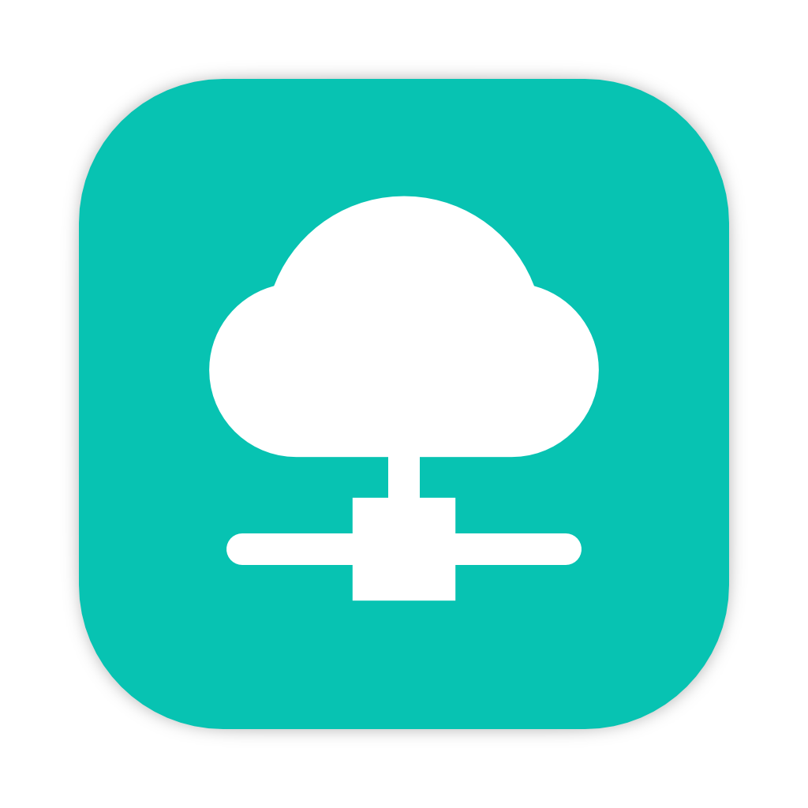
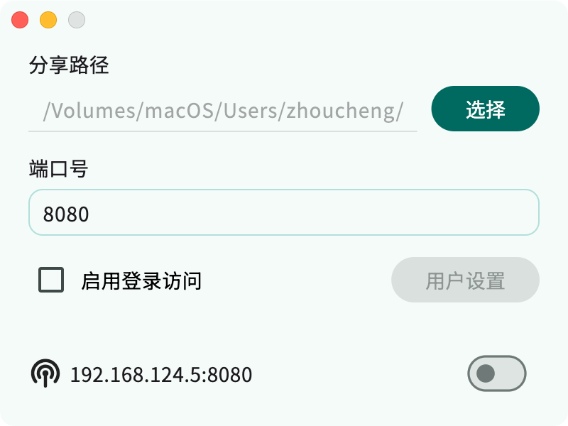

# DAV Server

## 简介

这是一个在本地搭建WebDAV服务的软件，可以快速地创建一个WebDAV服务器，支持用户身份验证

核心组件的仓库[在这里](https://github.com/Zhoucheng133/DAV-Core)

## 截图

## 使用

### 服务器端（分享文件的设备）

支持Windows和macOS系统，Linux系统理论也支持  
你只需要打开本软件-选择路径和端口号（默认8080）并且启动即可

### 客户端（访问文件的设备）

你可以使用任何支持访问WebDAV的文件管理软件来访问，建议使用:
- Documents (iOS)
- [质感文件](https://github.com/zhanghai/MaterialFiles) (Android)

## 在你的设备上配置DAV Server

### 在macOS上
- 安装Flutter到你的设备上
- 使用Visual Studio Code打开项目即可

### 在Windows上
- 你需要前往[核心组件的仓库](https://github.com/Zhoucheng133/DAV-Core)下载（或自行编译）dll动态库
- 安装Flutter到你的设备上
- 使用Visual Studio Code打开项目
- 在Debug或者Release中把dll复制到**输出位置**的根目录