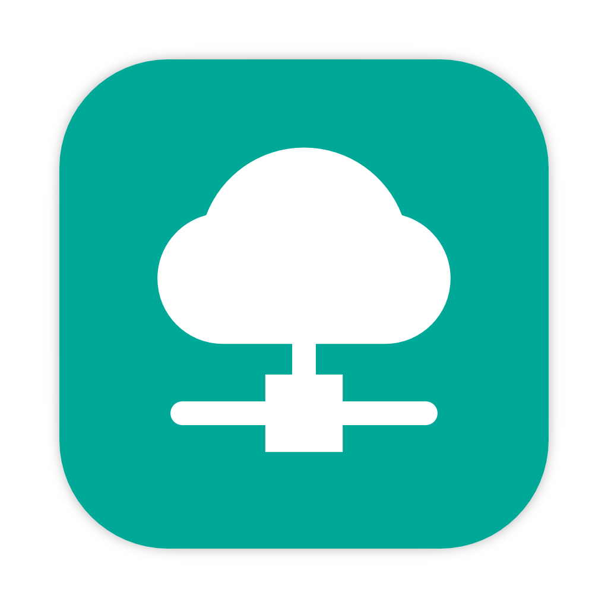

# DAV Server

## Introduction

This is a piece of software that allows you to set up a WebDAV service locally. It enables you to quickly create a WebDAV server and supports user authentication.

The repository for the core component is [here](https://github.com/Zhoucheng133/DAV-Core).

## Screenshots

## Usage

### Server side (device sharing files)

Supports Windows and macOS systems; Linux is theoretically supported as well.  
You only need to open this software, select a directory and a port number (default is 8080), and then start the server.

### Client side (device accessing files)

You can use any file management software that supports WebDAV access. Recommended options include:
- Documents (iOS)
- [Material Files](https://github.com/zhanghai/MaterialFiles) (Android)

## Configure DAV Server on Your Device

### On macOS
- Install Flutter on your device
- Open the project using Visual Studio Code

### On Windows
- Go to the [core component repository](https://github.com/Zhoucheng133/DAV-Core) to download (or compile yourself) the DLL dynamic library
- Install Flutter on your device
- Open the project using Visual Studio Code
- In Debug or Release mode, copy the DLL to the root directory of the **output location**
